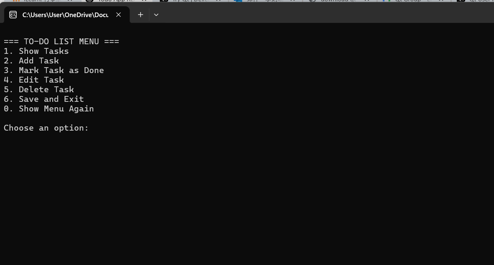
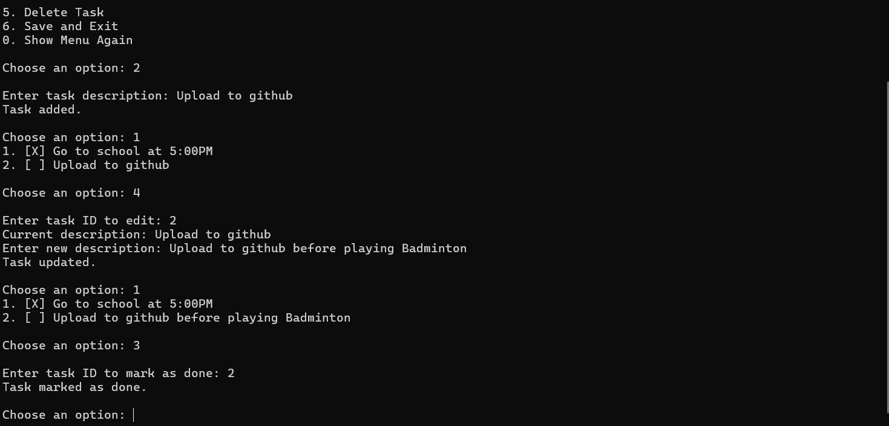

# 📝 To-Do List App (C++ CLI Version)

A simple command-line To-Do Tracker built in C++.

---

## ✅ Features

- Add, delete, and view tasks  
- Mark tasks as complete or incomplete  
- Automatically saves and loads tasks from file  

---

## 🛠️ Getting Started

### 1. Clone the Repository

```bash
git clone https://github.com/Sanchronyx/Tasks.git
cd Tasks
```

---

### 2. Compile the Application

Make sure you have `g++` installed on your system.

```bash
g++ src/main.cpp src/Task.cpp -o build/todo.exe
```

> 💡 **Tip:** If the `build/` directory doesn't exist yet, create it manually:
>
> ```bash
> mkdir build
> ```

---

### 3. Run the Application

#### On **Windows**:

```bash
cd build
start todo.exe
```

#### On **Linux/macOS**:

```bash
cd build
./todo
```

---

## 📁 Project Structure

```
Tasks/
├── src/
│   ├── main.cpp       # Entry point
│   ├── Task.cpp       # Task class implementation
│   └── Task.h         # Task class header
├── build/             # Compiled output
├── tasks.txt          # Auto-generated task data (if present)
└── README.md
```

---

## 💡 Notes

- Tasks are saved to `tasks.txt` in the project root directory.
- Recompile the app after modifying any `.cpp` or `.h` files.
- No external dependencies — uses only C++17 and STL.

---

## 🧩 Future Improvements

- GUI version using Qt (planned)  
- Task deadlines and prioritization  
- Search and sort functionality  

---

## APP IN USE



## 📜 License

MIT License — free to use, modify, and distribute.
